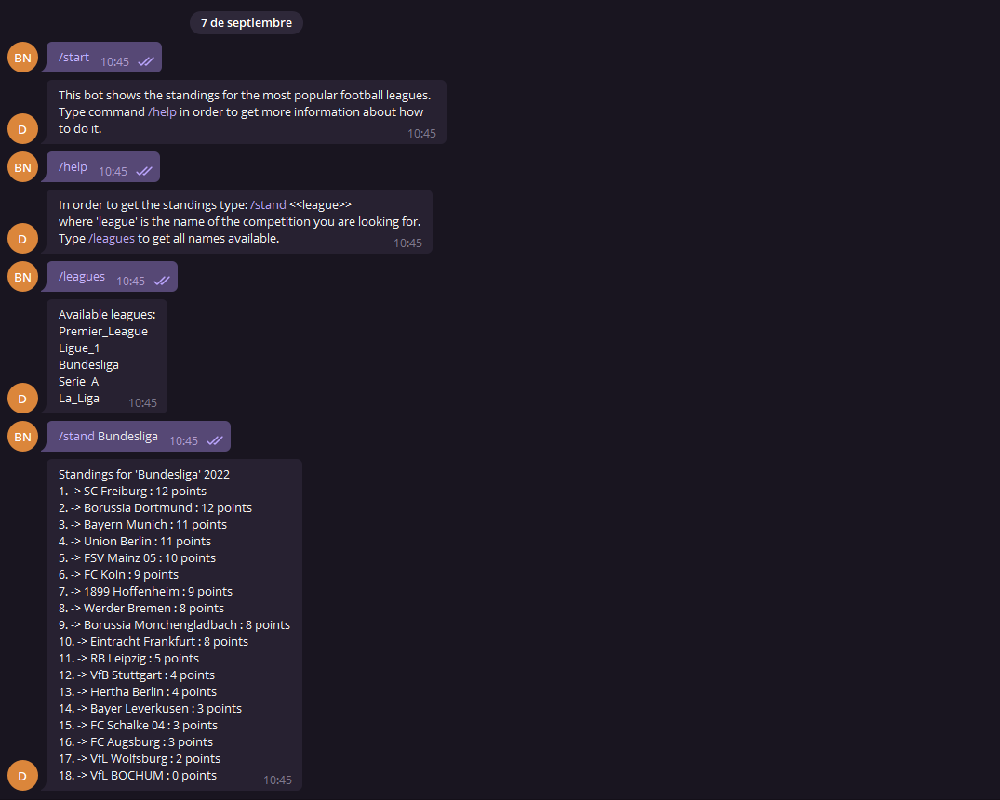

Telegram bot supported by requests calls to an API.

<h1 align="center">Telegram_Bot_Football_Results</h1>

    

Telegram bot that uses a request call to API-FOOTBALL in order to obtain the stands of the main european national competitions.

